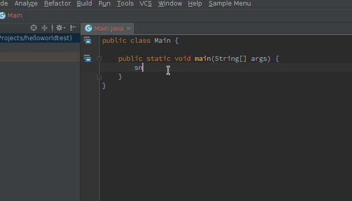

# #soreadytohelp

### Overview:

It's simple stack overflow helper plugin. 

Paste code from StackOverflow search result directly into IntellijIDEA, Android-Studio, PyCharm etc

### Usage:

1. Type searc phrase (U can use hashtags)
2. Pres ctrl+G, C

### Demo:

### Download:

TODO

### License
This plugin is available under the [Apache License, Version 2.0](http://www.apache.org/licenses/LICENSE-2.0).
